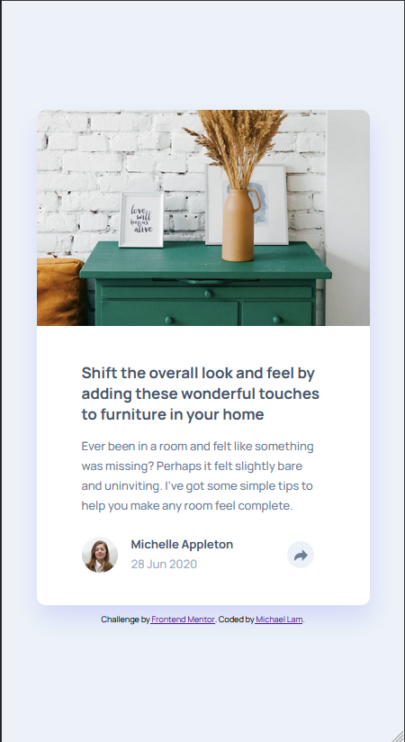

# Frontend Mentor - Article preview component solution

This is a solution to the [Article preview component challenge on Frontend Mentor](https://www.frontendmentor.io/challenges/article-preview-component-dYBN_pYFT). Frontend Mentor challenges help you improve your coding skills by building realistic projects. 

## Table of contents

- [Overview](#overview)
  - [The challenge](#the-challenge)
  - [Screenshot](#screenshot)
  - [Links](#links)
- [My process](#my-process)
  - [Built with](#built-with)
  - [What I learned](#what-i-learned)
  - [Continued development](#continued-development)
  - [Useful resources](#useful-resources)
- [Author](#author)
- [Acknowledgments](#acknowledgments)

**Note: Delete this note and update the table of contents based on what sections you keep.**

## Overview

### The challenge

Users should be able to:

- View the optimal layout for the component depending on their device's screen size
- See the social media share links when they click the share icon

### Screenshot

### Links
This was my first time using Netlify, since I started using React and didn't want to create a new repository for each challenge. The images aren't working properly, but you can refer to the screenshots above to see what it should look like. Alternatively, you can clone the repository and run it locally.

- Live Site URL: [Netlify Article Preview Component](https://michlam-article-preview-component.netlify.app/)

## My process
- Installed React with Vite and imported the original content
- Created the desktop design, as well as the mouse interactions
- Created the mobile design, as well as the interactions
- Deployed to Netlify

### Built with

- Semantic HTML5 markup
- CSS custom properties
- Flexbox
- [React](https://reactjs.org/) - JS library

### What I learned
This was a fantastic experience for me to put my React skills to the test. From creating the application, to custom components, to state logic, to deployment on Netlify, I learned a lot completing this challenge. I hope to continue to use React for future challenges, and for my skills to improve as well.
