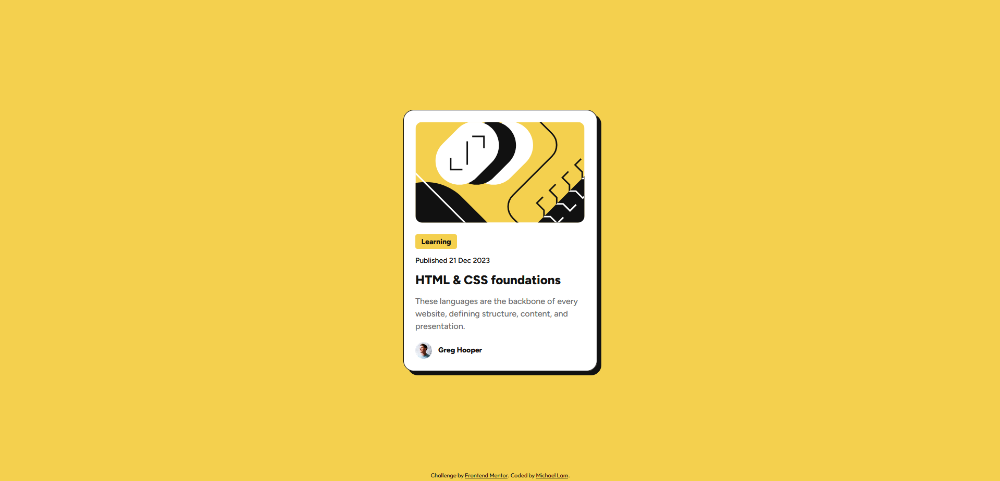

# Frontend Mentor - Blog preview card solution

This is a solution to the [Blog preview card challenge on Frontend Mentor](https://www.frontendmentor.io/challenges/blog-preview-card-ckPaj01IcS). Frontend Mentor challenges help you improve your coding skills by building realistic projects. 

## Table of contents

- [Overview](#overview)
  - [The challenge](#the-challenge)
  - [Screenshot](#screenshot)
- [My process](#my-process)
  - [Built with](#built-with)
  - [What I learned](#what-i-learned)

## Overview

### The challenge

Users should be able to:

- See hover and focus states for all interactive elements on the page

### Screenshot

## My process
- Plan out text in html
- Create card
- Place and resize illustration
- Create tag for "learning"
- Continue with the rest of the main text
- Add an author section for the avatar and name

### Built with

- HTML5 markup
- CSS custom properties
- Flexbox

### What I learned

I learned quite a lot about flex boxes, alignments, and how to manipulate images and text. It was a bit difficult to figure out how to get the image alignments centered while keeping the text alignments left-aligned, but once that was done, the rest was mostly smooth sailing.