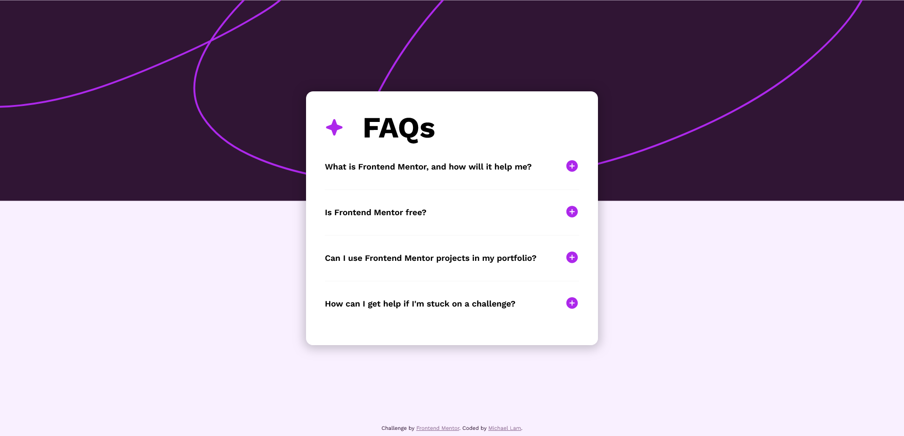
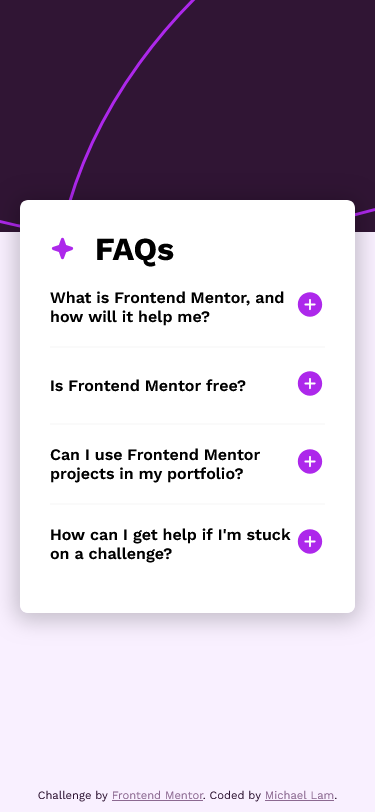

# Frontend Mentor - FAQ accordion solution

This is a solution to the [FAQ accordion challenge on Frontend Mentor](https://www.frontendmentor.io/challenges/faq-accordion-wyfFdeBwBz). Frontend Mentor challenges help you improve your coding skills by building realistic projects. 

## Table of contents

- [Overview](#overview)
  - [The challenge](#the-challenge)
  - [Screenshot](#screenshot)
  - [Links](#links)
- [My process](#my-process)
  - [Built with](#built-with)
  - [What I learned](#what-i-learned)

## Overview

### The challenge

Users should be able to:

- Hide/Show the answer to a question when the question is clicked
- Navigate the questions and hide/show answers using keyboard navigation alone
- View the optimal layout for the interface depending on their device's screen size
- See hover and focus states for all interactive elements on the page

### Screenshot

### Links

- Live Site URL: [https://michlam-faq-accordion.netlify.app/](https://michlam-faq-accordion.netlify.app/)

## My process
- Setup React project with Vite
- Basic background and styling
- Main card and title styling, semantic HTML structuring
- Mobile styling
- Deploy with Netlify

### Built with

- Semantic HTML5 markup
- CSS custom properties
- Flexbox
- [React](https://reactjs.org/) - JS library

### What I learned

Surprisingly, this was my first time creating an accordion menu. I thought it would take some annoying state to pull off, but it turns out HTML comes with some neat functionality with the details and summary elements. With some cool styling and pseudo-elements, I was able to recreate the design fairly well. I also worked on my speed and debugging, which is always great.