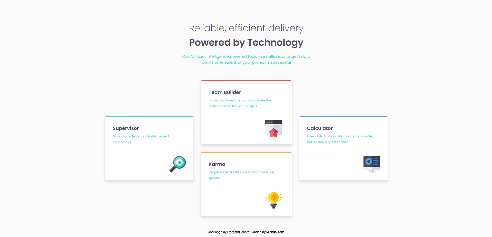

# Frontend Mentor - Four card feature section solution

This is a solution to the [Four card feature section challenge on Frontend Mentor](https://www.frontendmentor.io/challenges/four-card-feature-section-weK1eFYK). Frontend Mentor challenges help you improve your coding skills by building realistic projects. 

## Table of contents

- [Overview](#overview)
  - [The challenge](#the-challenge)
  - [Screenshot](#screenshot)
- [My process](#my-process)
  - [Built with](#built-with)
  - [What I learned](#what-i-learned)

## Overview

### The challenge

Users should be able to:

- View the optimal layout for the site depending on their device's screen size

### Screenshot

## My process
- Create the header and styling
- Create a flexbox with three columns
- Create a center column with team builder and karma cards
- Complete each card individually
- Complete mobile media-queries

### Built with

- Semantic HTML5 markup
- CSS custom properties
- Flexbox
- Mobile-first workflow

### What I learned

After doing some practice with React, as well as the previous Frontend Mentor challenges, I'm really getting the hang of challenges of this level. I am able to quickly visualize how I can structure the entire website, as well as think ahead for how each component will be created and how the mobile media queries will be done. I also learned a great deal about flex boxes, particularly to solve the center column for this challenge.

