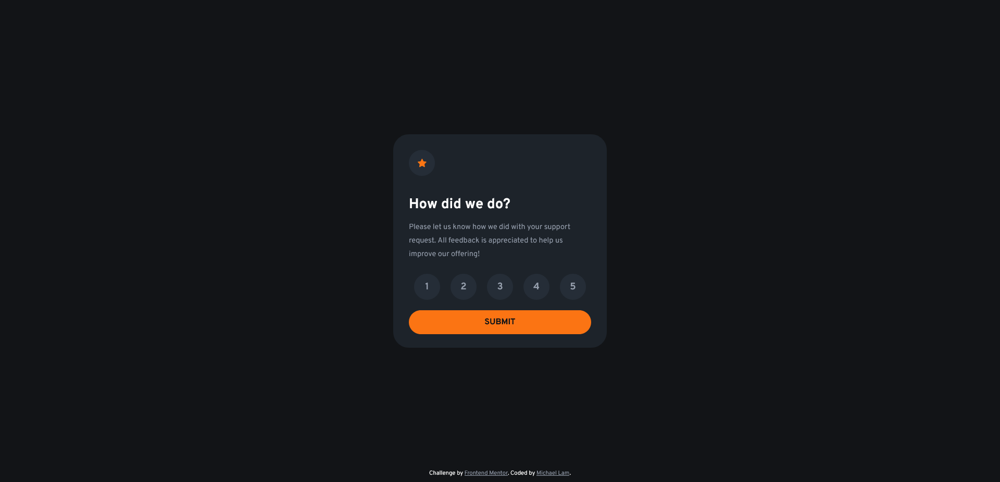
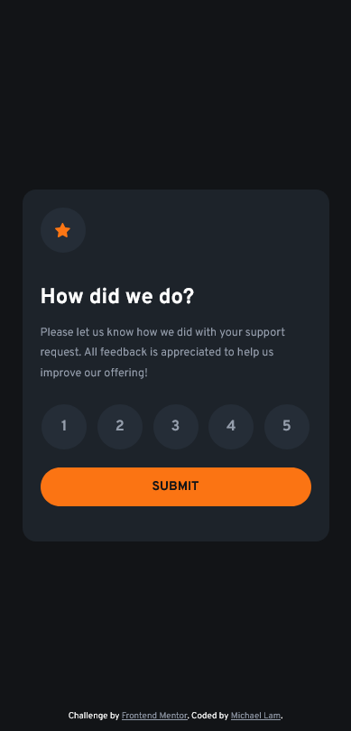

# Frontend Mentor - Interactive rating component solution

This is a solution to the [Interactive rating component challenge on Frontend Mentor](https://www.frontendmentor.io/challenges/interactive-rating-component-koxpeBUmI). Frontend Mentor challenges help you improve your coding skills by building realistic projects. 

## Table of contents

- [Overview](#overview)
  - [The challenge](#the-challenge)
  - [Screenshot](#screenshot)
  - [Links](#links)
- [My process](#my-process)
  - [Built with](#built-with)
  - [What I learned](#what-i-learned)

## Overview

### The challenge

Users should be able to:

- View the optimal layout for the app depending on their device's screen size
- See hover states for all interactive elements on the page
- Select and submit a number rating
- See the "Thank you" card state after submitting a rating

### Screenshot

### Links

- Live Site URL: [https://michlam-interactive-rating-component.netlify.app/](https://michlam-interactive-rating-component.netlify.app/)

## My process
- Setup React with Vite
- Create main content for the ratings selector
- Create the thank you page
- Add user interaction with states
- Add mobile responsiveness
- Deploy with Netlify

### Built with

- Semantic HTML5 markup
- CSS custom properties
- Flexbox
- [React](https://reactjs.org/) - JS library

### What I learned
While I didn't learn too much new for this challenge, it was great practice, particularly with useState, forms, and buttons. Getting more practice with an actual application, rather than only UI is always a good opporrtunity. It also gave me a good benchmark as to how quickly I can create a simple frontend based off of a design.
