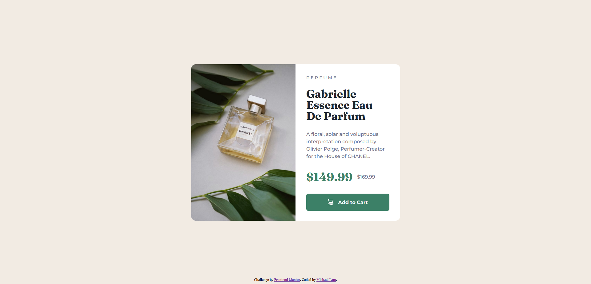

# Frontend Mentor - Product preview card component solution

This is a solution to the [Product preview card component challenge on Frontend Mentor](https://www.frontendmentor.io/challenges/product-preview-card-component-GO7UmttRfa). Frontend Mentor challenges help you improve your coding skills by building realistic projects. 

## Table of contents

- [Overview](#overview)
  - [The challenge](#the-challenge)
  - [Screenshot](#screenshot)
- [My process](#my-process)
  - [Built with](#built-with)
  - [What I learned](#what-i-learned)

## Overview

### The challenge

Users should be able to:

- View the optimal layout depending on their device's screen size
- See hover and focus states for interactive elements

### Screenshot

## My process
- Set the background
- Set the main card and its flexbox
- Set the image and main content for desktop
- Add responsiveness for mobile devices

### Built with
- Semantic HTML5 markup
- CSS custom properties
- Flexbox

### What I learned

I learned a lot about flexboxes, especially getting a better idea of how I can arrange rows and columns to make the website follow the look that I want. It was difficult to get the image changes to work, since the picture tag wasn't scaling the way I wanted it to, but I managed to make it work. I also got more experience with media queries, which is always nice.
