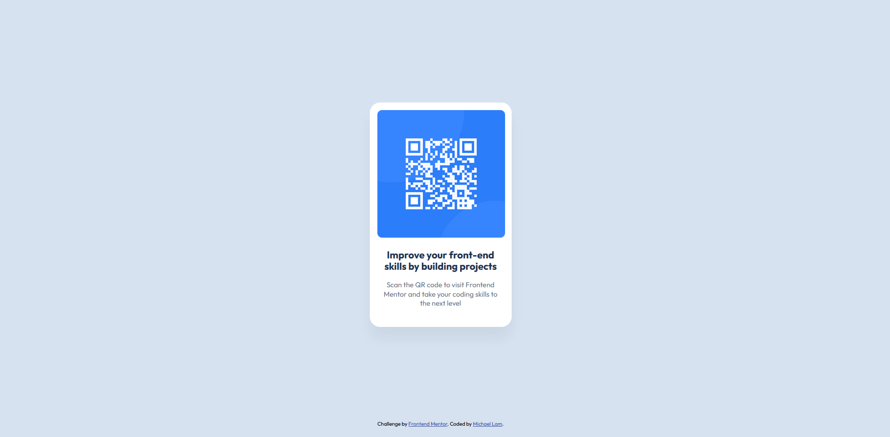

# Frontend Mentor - QR code component solution

This is a solution to the [QR code component challenge on Frontend Mentor](https://www.frontendmentor.io/challenges/qr-code-component-iux_sIO_H). Frontend Mentor challenges help you improve your coding skills by building realistic projects. 

## Table of contents

- [Overview](#overview)
  - [Screenshot](#screenshot)
  - [Links](#links)
- [My process](#my-process)
  - [Built with](#built-with)
  - [What I learned](#what-i-learned)

## Overview

### Screenshot

### Links
- Live Site URL: [Add live site URL here](https://your-live-site-url.com)

## My process
- Changed background colour
- Added card and styling for card
- Added styling for text
- Added styling for attribution

### Built with
- HTML5 markup
- CSS custom properties
- Flexbox

### What I learned

This is a great refresher for HTML and CSS. Personally, I have never been a great front-end developer, but I hope to be able to continue this journey and build some beautiful webpages.
