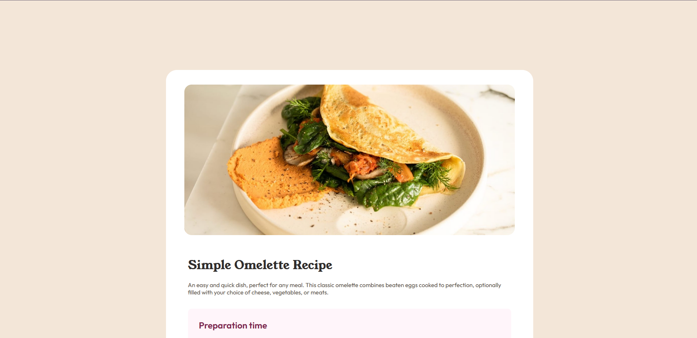

# Frontend Mentor - Recipe page solution

This is a solution to the [Recipe page challenge on Frontend Mentor](https://www.frontendmentor.io/challenges/recipe-page-KiTsR8QQKm). Frontend Mentor challenges help you improve your coding skills by building realistic projects. 

## Table of contents

- [Overview](#overview)
  - [The challenge](#the-challenge)
  - [Screenshot](#screenshot)
- [My process](#my-process)
  - [Built with](#built-with)
  - [What I learned](#what-i-learned)

## Overview

### Screenshot

## My process
- Set the background
- Set the main card and its text
- Create preparation, ingredients, instructions, and nutrition sections individually
- Create the nutrition table
- Added responsiveness for mobile devices.

### Built with

- Semantic HTML5 markup
- CSS custom properties
- Flexbox

**Note: These are just examples. Delete this note and replace the list above with your own choices**

### What I learned

Building on the previous challenge, I spent more effort getting the mobile device responsiveness down. I believe I have improved in that regard. This was also my first time working with styling tables, which was more doable than I imagined. All in all, a great learning experience!
