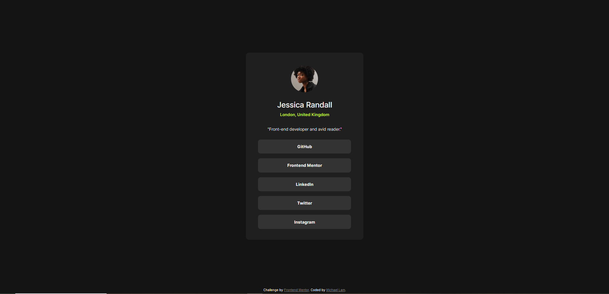

# Frontend Mentor - QR code component solution

This is a solution to the [QR code component challenge on Frontend Mentor](https://www.frontendmentor.io/challenges/social-links-profile-UG32l9m6dQ). Frontend Mentor challenges help you improve your coding skills by building realistic projects. 

## Table of contents

- [Overview](#overview)
  - [Screenshot](#screenshot)
- [My process](#my-process)
  - [Built with](#built-with)
  - [What I learned](#what-i-learned)

## Overview

### Screenshot

## My process
- Changed background colour
- Added card and styling for card
- Added avatar icon
- Added main text and styling
- Added buttons

### Built with
- HTML5 markup
- CSS custom properties
- Flexbox

### What I learned

This was the first challenge that I tried to make the webpage more responsive and had mobile designs in mind. I tried using media queries, which was easier than I expected. All in all, a great learning experience.
