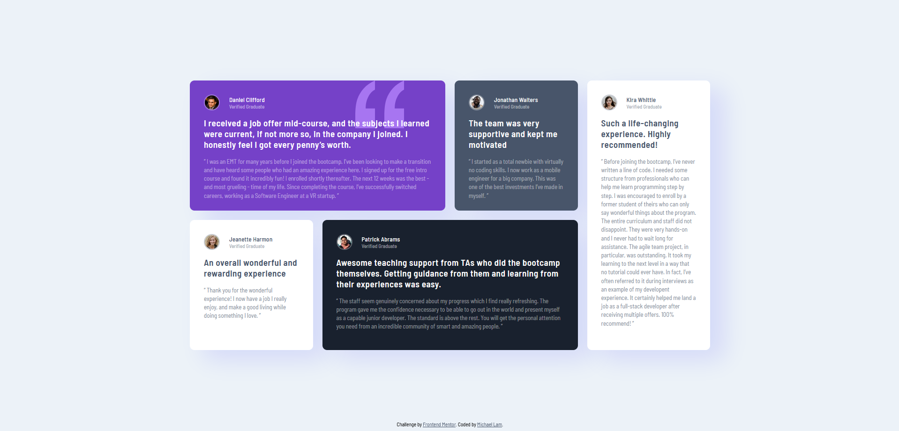

# Frontend Mentor - Testimonials grid section solution

This is a solution to the [Testimonials grid section challenge on Frontend Mentor](https://www.frontendmentor.io/challenges/testimonials-grid-section-Nnw6J7Un7). Frontend Mentor challenges help you improve your coding skills by building realistic projects. 

## Table of contents

- [Overview](#overview)
  - [The challenge](#the-challenge)
  - [Screenshot](#screenshot)
- [My process](#my-process)
  - [Built with](#built-with)
  - [What I learned](#what-i-learned)

**Note: Delete this note and update the table of contents based on what sections you keep.**

## Overview

### The challenge

Users should be able to:

- View the optimal layout for the site depending on their device's screen size

### Screenshot

## My process
- Create the main element where all the cards will be located
- Create the css grid box and all the card positioning
- Populate each card with semantic html
- Create all the styling for each card
- Complete mobile design

### Built with

- Semantic HTML5 markup
- CSS custom properties
- Flexbox
- CSS Grid
- Mobile-first workflow

### What I learned

This was my first experience with CSS grids, and I found the experience a lot nicer than I expected. Since I had spent most of my time with flex boxes up until now, I wasn't sure if I could learn grids too easily, but it wasn't bad. Also, as the challenges get more complex, I'm continuously thinking about how I could use React instead of normal HTML and CSS. Even if I don't use React, the process of thinking of how I would do each design is good practice itself.
