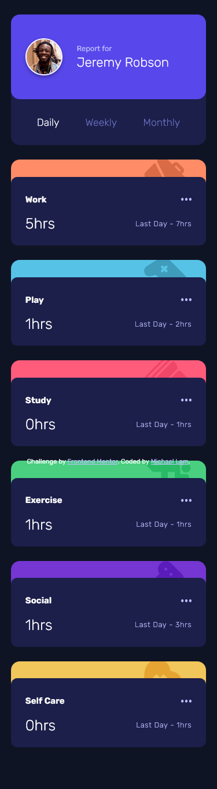

# Frontend Mentor - Time tracking dashboard solution

This is a solution to the [Time tracking dashboard challenge on Frontend Mentor](https://www.frontendmentor.io/challenges/time-tracking-dashboard-UIQ7167Jw). Frontend Mentor challenges help you improve your coding skills by building realistic projects. 

## Table of contents

- [Overview](#overview)
  - [The challenge](#the-challenge)
  - [Screenshot](#screenshot)
  - [Links](#links)
- [My process](#my-process)
  - [Built with](#built-with)
  - [What I learned](#what-i-learned)

## Overview

### The challenge

Users should be able to:

- View the optimal layout for the site depending on their device's screen size
- See hover states for all interactive elements on the page
- Switch between viewing Daily, Weekly, and Monthly stats

### Screenshot

### Links

- Live Site URL: [https://michlam-time-tracking-dashboard.netlify.app/](https://michlam-time-tracking-dashboard.netlify.app/)

## My process
- Setup project in React with Vite
- Basic structuring with main card, profile, and timecards
- Profile and timecard styling
- Add responsiveness and JavaScript logic
- Mobile design and responsiveness
- Host on Netlify

### Built with

- Semantic HTML5 markup
- CSS custom properties
- Flexbox
- CSS Grid
- [React](https://reactjs.org/) - JS library

### What I learned

This challenge was great for me to practice my Javascript logic and how it interacts with React components. Being able to ensure data driven development with Daily, Weekly, and Monthly time periods was difficult to figure out at first, but was rewarding once I solved that issue. All in all, great practice.