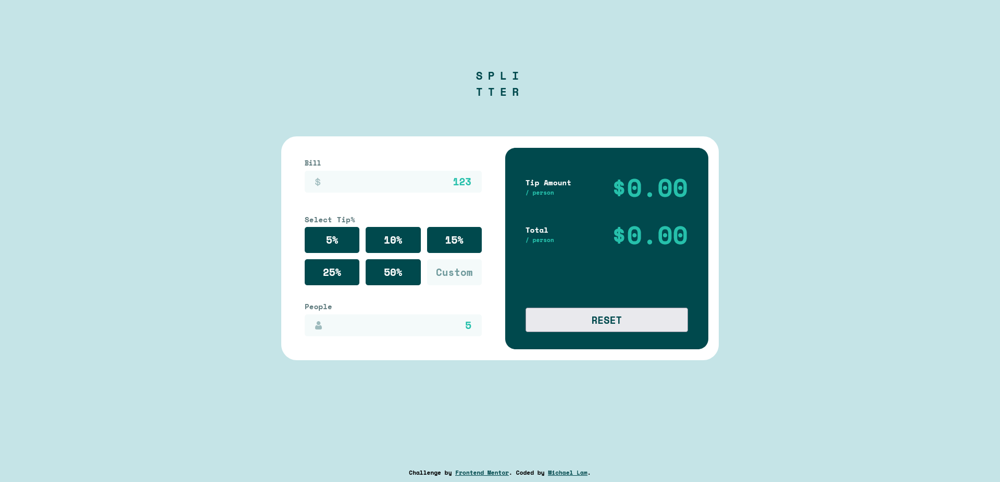
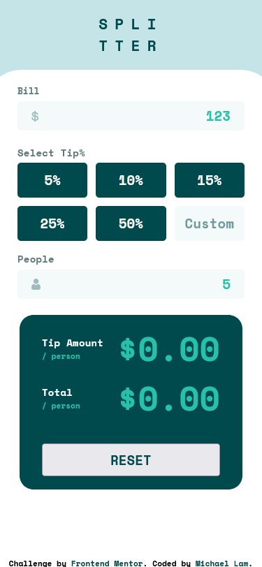

# Frontend Mentor - Tip calculator app solution

This is a solution to the [Tip calculator app challenge on Frontend Mentor](https://www.frontendmentor.io/challenges/tip-calculator-app-ugJNGbJUX). Frontend Mentor challenges help you improve your coding skills by building realistic projects.

## Table of contents

- [Overview](#overview)
  - [The challenge](#the-challenge)
  - [Screenshot](#screenshot)
  - [Links](#links)
- [My process](#my-process)
  - [Built with](#built-with)
  - [What I learned](#what-i-learned)

## Overview

### The challenge

Users should be able to:

- View the optimal layout for the app depending on their device's screen size
- See hover states for all interactive elements on the page
- Calculate the correct tip and total cost of the bill per person

### Screenshot

### Links

- Live Site URL: [https://michlam-tip-calculator.netlify.app/](https://michlam-tip-calculator.netlify.app/)

## My process
- Setup React project with Vite
- Basic structuring with semantic HTML and React
- Complete all card styling for desktop design
- Add state for tipping logic and responsiveness
- Add error handling and responsiveness
- Complete styling for mobile design
- Build and deploy to Netlify

### Built with

- Semantic HTML5 markup
- CSS custom properties
- Flexbox
- CSS Grid
- Mobile-first workflow
- [React](https://reactjs.org/) - JS library
- Netlify

### What I learned

This challenge was a very good opportunity to practice both my React and JavaScript skills. In particular, this felt like a complete application that I was able to create from start to finish. Furthermore, paying more attention to error conditions was a good opportunity as well. All in all, a great challenge to test my skills.
